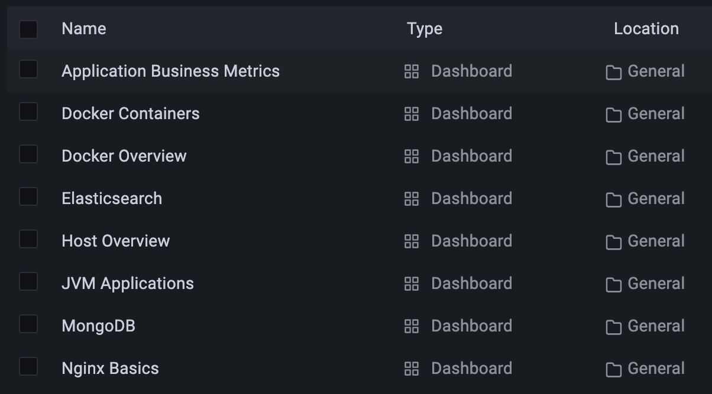
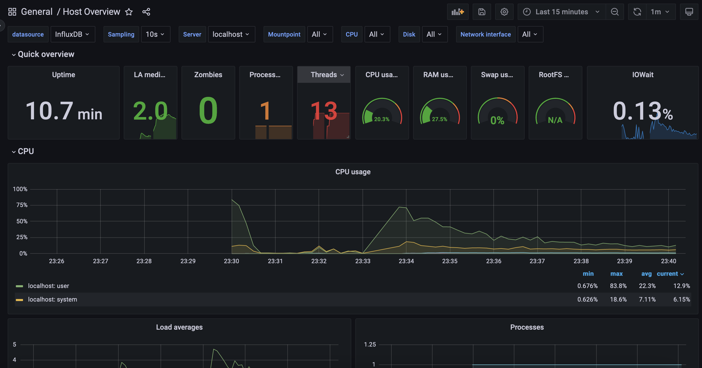
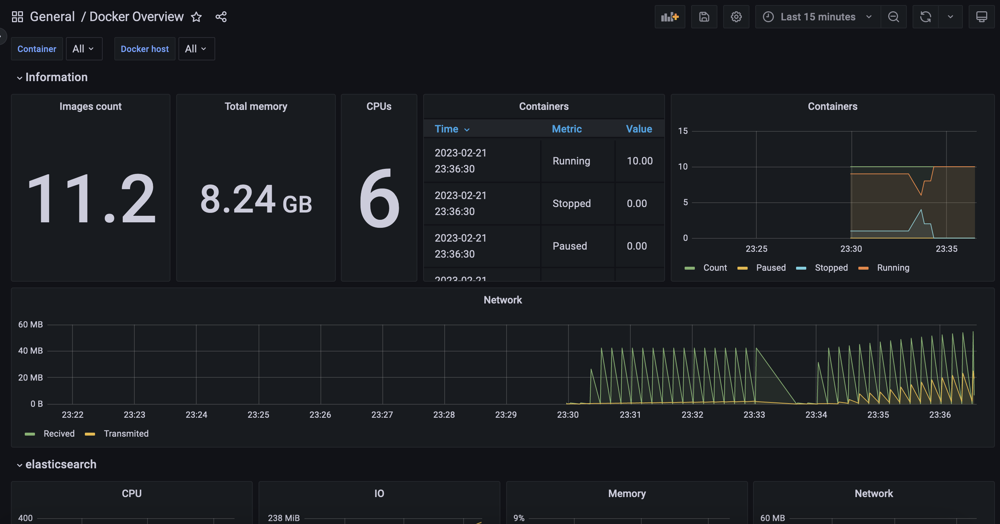
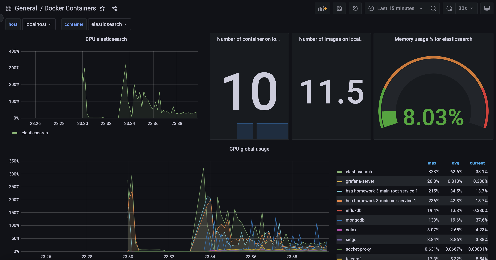
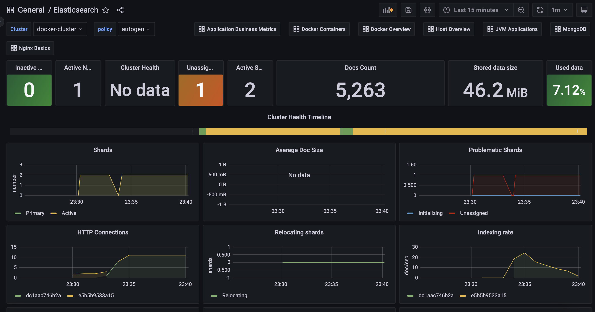
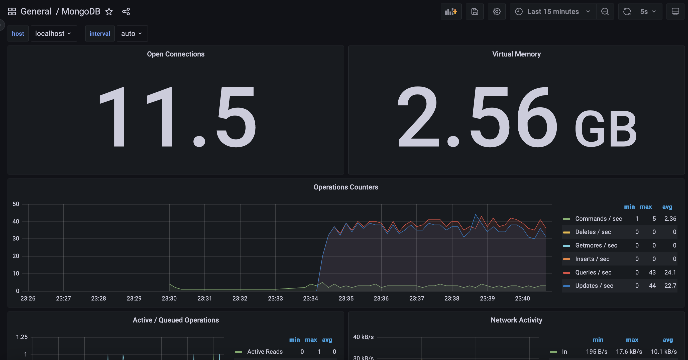
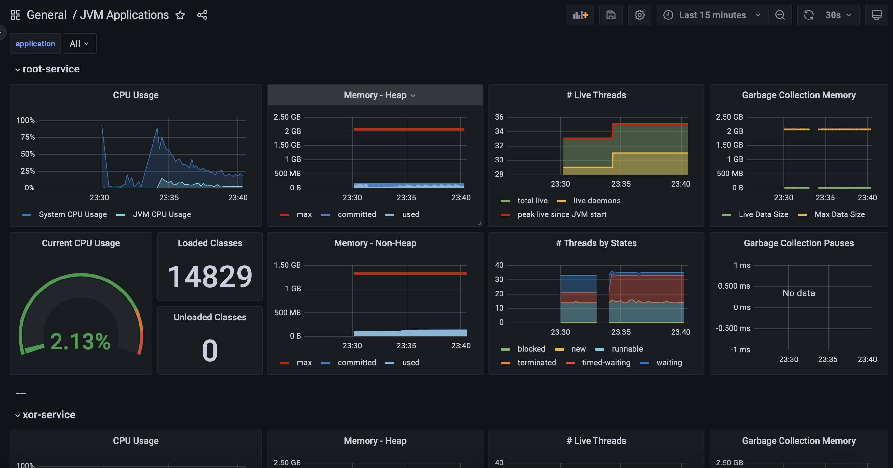
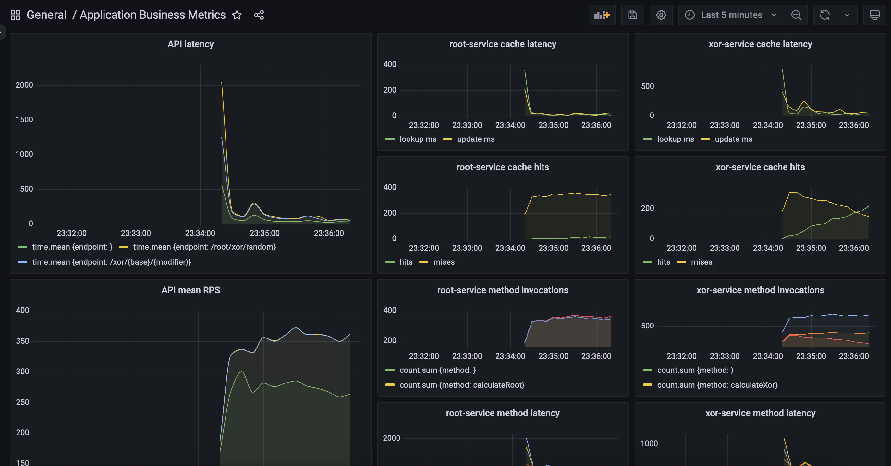
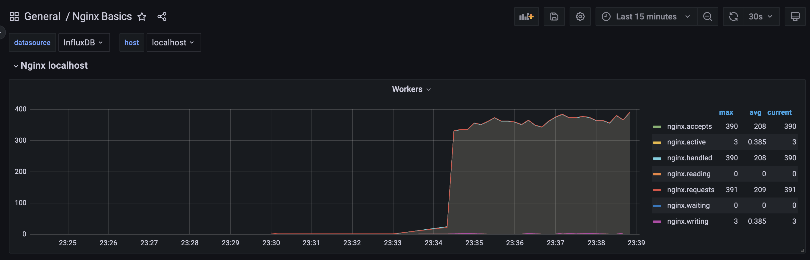

# Highload Software Architecture 8 Lesson 3 Homework

Presentation
---

[Grafana](http://localhost:3000) contains 8 dashboards for different aspects of monitoring:

## [Host Overview](http://localhost:3000/d/hsal2-01/host-overview)

Metrics about the host itself, like CPU, memory, disk, network, etc. In this demo, it's a Docker virtual machine.

## [Docker Overview](http://localhost:3000/d/hsal2-02/docker-overview)

General metrics about Docker containers, like CPU, memory, network, etc.

## [Docker Containers](http://localhost:3000/d/hsal2-03/docker-containers)

Individual container metrics

## [Elasticsearch](http://localhost:3000/d/hsal2-04/elasticsearch)

## [MongoDB](http://localhost:3000/d/hsal2-05/mongodb)

## [JVM Applications](http://localhost:3000/d/hsal2-06/jvm-applications)

JVM metrics for both services

## [Application Business Metrics](http://localhost:3000/d/hsal2-07/application-business-metrics)

Metrics about the application itself, like requests per second, response time, cache performance, method invocations, etc.

## [Nginx Basics](http://localhost:3000/d/hsal2-08/nginx-basics)

Basic metrics about Nginx. Looks like open source version of nginx doesn't provide much information.

