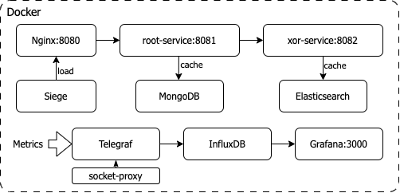

# Highload Software Architecture 8 Lesson 3 Homework

Resource monitoring systems
---

## How to run demo

Preferred way:

```bash
./demo.sh
```

After everything starts, you can open [http://localhost:3000](http://localhost:3000) to see Grafana dashboards.
Credentials:

```
username: admin
password: admin
```

There are 8 [preconfigured dashboards](http://localhost:3000/dashboards) int the General folder.

**In case of any trouble running the demo, please review [the presentation](PRESENTATION.md)**

Or see [this section](#running-docker-compose) on how to run the demo manually.

## Demo project structure

The idea of a project is to calculate a simple mathematical formula `sqrt(xor(a, b))` in a most entertaining way: *root-service*
receives `a` and `b` via REST endpoint, forwards execution of `xor()` part to the *xor-service* using ist REST API, and performs `sqrt()` on
the result.

To emulate complexity/latency, both services have a limitation on how many mathematical operations can be performed in a second. Also, both
services utilize caching to speed up calculations. Eventually, caching gives a performance boost.

*root-service* uses MongoDB as a cache, *xor-service* uses Elasticsearch. *xor-service* also precalculates additional results in advance, so
it's cache improves performance much sooner.

I used such an extended setup to experiment with Zipkin tracing and a bunch of other ideas, but didn't have time to implement them for now.



Project contains in total 10 containers:

* Nginx - reverse proxy for root-service
* root-service - main service to receive traffic
* xor-service - secondary service for an additional hop
* MongoDB - cache for root-service
* Elasticsearch - cache for xor-service
* Telegraf - metrics collector
* InfluxDB - metrics storage
* Grafana - metrics visualization
* socket-proxy - to expose Docker socket to Telegraf in a secure way
* siege - load generator

## Java services

Services are written in Kotlin using Spring Boot 3. Their images are prebuilt and available on Docker
Hub: [root-service](https://hub.docker.com/repository/docker/ssamoilenko/hsal2-root-service/general)
and [xor-service](https://hub.docker.com/repository/docker/ssamoilenko/hsal2-xor-service/general).

To build them locally, run `docker-compose build xor-service root-service` in the root directory. No additional prerequisites are required.

#### xor-service

is exposed under `http://localhost:8082` and has a calculation endpoint:
`/xor/{base}/{modifier}` and a service endpoint: `/data/drop` to drop the cache.

#### root-service

is exposed under `http://localhost:8081` and has a calculation endpoint:
`/root/xor/{base}/{modifier}` and a helper endpoint: `/root/xor/random` to calculate random `base` and `modifier` values.
`base` is randomly generated on each service restart, `modifier` is randomly generated on each request.

It also has a service endpoint: `/data/drop` to drop the cache.

## Project structure

The project intentionally contains `.idea` and `.iml` files to make it easier to open in IntelliJ IDEA.

* **config** - contains configuration files for docker containers.
* **data** - subdirectories are mounted as data volumes for containers.
* **docs** - contains images for this README.
* **services** - contains source code for Java services.

## Running docker-compose

The demo is fully enclosed in the [docker-compose.yaml](docker-compose.yaml). Instead of using `./demo.sh` You can also run both services
and monitoring by:

```bash
docker-compose up nginx grafana -d
```

Sample load won't start in this case. To run it, use:

```bash
docker-compose up siege -d
```

or manually:

```bash
siege -c 10 -t 10m http://localhost:8081/root/xor/random
```
